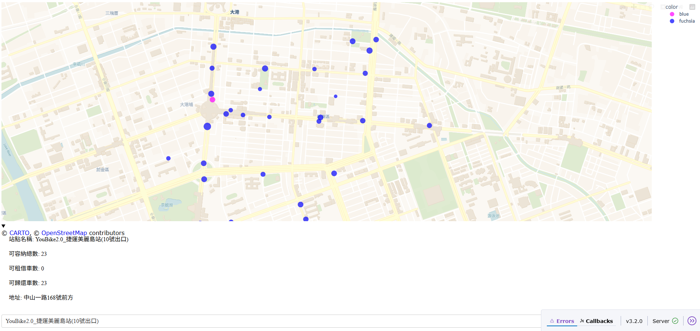

# 高雄市公共自行車即時資訊視覺化系統

🚴‍♂️ 一個基於 TDX 開放資料平台的高雄市公共自行車站點即時資訊視覺化 Web 應用程式



## 📋 專案簡介

這個專案使用 Python 開發，整合了 TDX (Transport Data eXchange) 交通資料流通服務平台的 API，提供高雄市公共自行車站點的即時資訊視覺化。使用者可以透過互動式地圖查看各站點的位置、可租借車數、可歸還車數等詳細資訊。

## ✨ 主要功能

- 🗺️ **互動式地圖**：使用 Plotly 建立的互動式地圖介面
- 📍 **站點定位**：顯示所有公共自行車站點的精確位置
- 📊 **即時資訊**：提供各站點的即時可用車輛和停車位數量
- 🔍 **站點搜尋**：下拉式選單快速選擇特定站點
- 📱 **響應式設計**：支援不同螢幕尺寸的裝置瀏覽
- ⚡ **即時更新**：透過 TDX API 取得最新的站點資訊

## 🛠️ 技術棧

- **Python 3.12+**
- **Dash** - Web 應用程式框架
- **Plotly** - 資料視覺化和互動式圖表
- **Pandas** - 資料處理和分析
- **Requests** - HTTP 請求處理
- **TDX API** - 交通資料來源

## 📦 安裝與設定

### 1. 環境需求

```bash
Python 3.12 或更高版本
```

### 2. 複製專案

```bash
git clone https://github.com/yourusername/kaohsiung-bike-info.git
cd kaohsiung-bike-info
```

### 3. 建立虛擬環境

```bash
python -m venv .venv
```

### 4. 啟動虛擬環境

**Windows:**
```bash
.venv\Scripts\activate
```

**macOS/Linux:**
```bash
source .venv/bin/activate
```

### 5. 安裝相依套件

```bash
pip install plotly dash pandas requests
```

### 6. 設定 TDX API 金鑰

在 `final_TDX.py` 檔案中更新你的 TDX API 認證資訊：

```python
app_id = '你的_APP_ID'
app_key = '你的_APP_KEY'
```

> 📝 **取得 TDX API 金鑰**：請至 [TDX 運輸資料流通服務](https://tdx.transportdata.tw/) 註冊帳號並申請 API 金鑰

## 🚀 使用方式

### 啟動應用程式

```bash
python final_TDX.py
```

### 瀏覽應用程式

開啟瀏覽器並前往：
```
http://127.0.0.1:8050/
```

### 功能說明

1. **地圖瀏覽**：使用滑鼠拖曳、縮放地圖
2. **站點資訊**：將滑鼠懸停在站點上查看詳細資訊
3. **站點選擇**：使用下拉選單選擇特定站點，地圖會自動縮放至該位置
4. **資訊面板**：選擇站點後，下方會顯示詳細的站點資訊

## 📊 資料欄位說明

| 欄位名稱 | 說明 |
|---------|------|
| 站點名稱 | 公共自行車站點的名稱 |
| 可容納總數 | 該站點的總停車位數量 |
| 可租借車數 | 目前可供租借的自行車數量 |
| 可歸還車數 | 目前可供歸還的空位數量 |
| 地址 | 站點的詳細地址 |
| 緯度/經度 | 站點的地理座標 |

## 🏗️ 專案結構

```
Final/
├── final_TDX.py          # 主程式檔案
├── README.md             # 專案說明文件
├── 截圖一.png            # 應用程式截圖
└── .venv/                # Python 虛擬環境
```

## 🔧 核心功能模組

### Auth 類別
負責處理 TDX API 的身份驗證，取得存取令牌

### 資料擷取函數
- `fetch_data()`: 從 TDX API 擷取資料
- `create_dataframe()`: 整合站點資料和可用性資料

### 視覺化函數
- `create_map_figure()`: 建立互動式地圖視覺化

## 🤝 貢獻指南

歡迎提交 Issue 和 Pull Request！

1. Fork 這個專案
2. 建立你的功能分支 (`git checkout -b feature/AmazingFeature`)
3. 提交你的變更 (`git commit -m 'Add some AmazingFeature'`)
4. 推送到分支 (`git push origin feature/AmazingFeature`)
5. 開啟一個 Pull Request

## 📄 授權條款

這個專案使用 MIT 授權條款 - 查看 [LICENSE](LICENSE) 檔案了解詳情

## 🙏 致謝

- [TDX 運輸資料流通服務](https://tdx.transportdata.tw/) 提供開放資料 API
- [Plotly](https://plotly.com/) 提供優秀的資料視覺化工具
- [Dash](https://dash.plotly.com/) 提供 Web 應用程式框架
